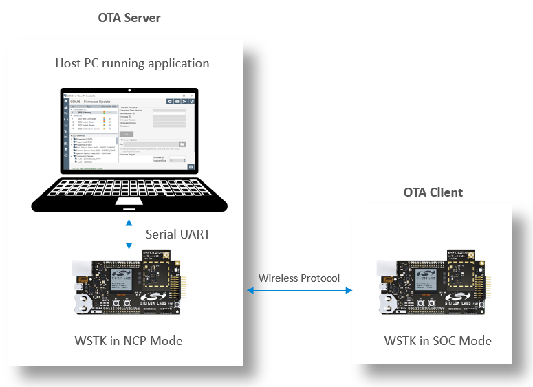
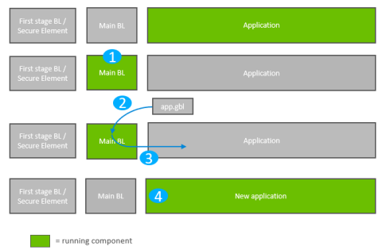
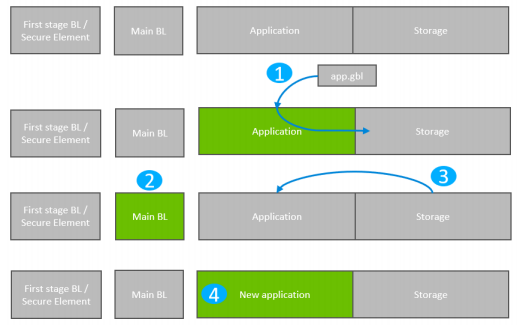
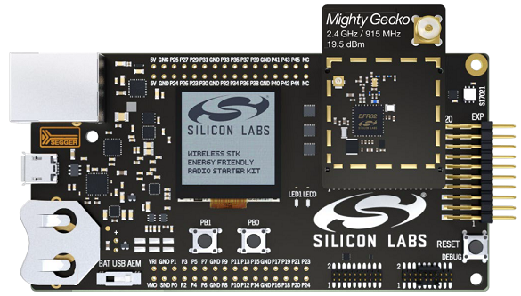
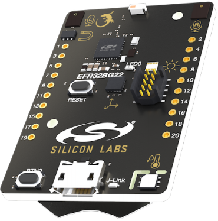
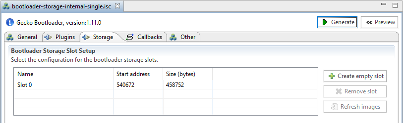

# 1. Introduction
OTA (over-the-air) is a mechanism for remotely updating IoT device with new settings or firmware. The OTA Update mechanism is a core part of a IoT system’s architecture. OTA architectures for IoT contains two major part: Client and Server. The name can be vary on different wireless product. We define the terms here to make it not confused by different name of the role. 

__Client__: It can be the IoT end device or gateway which is capable of receiving new firmware image from a remote server. 

__Server__: It is responsible for sending firmware image to the client. It can be cloud or local host(gateway) that is able to locally connect with client device. 

Silicon Labs has various wireless products, like Bluetooth LE/Mesh, Zigbee, Proprietary and Z-Wave. The operations are vary, some of them require many human interactions. Here we would like to unify the process and simplify the operation during the OTA update procedure. 

We would talk in details for different protocol OTA optimization start from 3rd sections. We will show how it works right now, and what we are gonna to do to optimize the OTA process. As a final result, user should experience the same feeling on the OTA procedure no matter Bluetooth LE/Mesh, Zigbee or Proprietary. 


## 1.1. Silicon Labs Solution Introduction
Before we start the discussion we would like to clarify some terms and basic knowledge of current design. 

* System on Chip(SoC) mode
  
  The SoC mode means full functional firmware running on Silicon Labs Wireless Starter Kit(WSTK) Board. The role can be client or server depends what function enabled in the firmware. 
* Network Coprocessor(NCP) mode
  
  The NCP mode mean it needs to cooperate with a host processor to achieve the full function protocol. In general, it is used in OTA server. Here is diagram of a OTA server(Host+NCP) and OTA client.
<div align="center">
  
</div> 

* Standalone bootloader and application bootloader
  
  The bootloader consists of two parts. Main BL and First stage BL. The Main BL is for update application firmware. The first stage BL is for update Main BL. 

  * The standalone bootloader works with NCP mode firmware. The Main BL supports XModem protocol that receive NCP image from host and update the application firmware. 
<div align="center">
  
</div> 

  * The application bootloader works with SoC mode firmware. The application firmware receives the OTA image and store it on the internal flash. Then reboot to bootloader and Main BL read OTA image from internal flash storage area and update it to the application area. 

<div align="center">
  
</div> 

detailed info of bootloader can be found at [UG266: Silicon Labs Gecko Bootloader User’s Guide][UG266].

## 1.2. IoT OTA Update Structure Definition
We define the general OTA update structure that implements to all protocols: Zigbee, Proprietary and Bluetooth. That helps us to simplify the design and make it more clear to users. 

* **Client** is same for each product(Proprietary, Zigbee, Bluetooth)
  * The Bootloader and the first copy of Client Application image need be programmed by Commander.exe
  * Client Application start OTA request, received the OTA image and store it into internal flash slot
  * Internal Storage Application Bootloader, get OTA image from internal flash and update the application area

* **Server** consists of two mode, SoC and NCP.

  * **SoC**:
    * The Bootloader, Server Application and OTA image need to be programmed by Commande.exe
    * Server Application running from EFR32 read the OTA image from its internal flash slot and send it to client
    * Internal Storage Application Bootloader

  * **NCP**:
    * The Bootloader and first copy of NCP image need to be programmed by Commander.exe.
    * The Server Application need to be built in host system, the OTA image need to be copied on specific host directory.
    * Server Application runs from host and co-work with NCP via UART connection, read OTA image from host filesystem and send it to client
    * Standalone XModem Bootloader, get NCP image from host by XModem protocol and update NCP image


# 2. Prerequisite 

## 2.1. Hardware Requirement
* 2 WSTK main development boards
* 2 EFR32MG12 radio boards (BRD4162A)

  Or
* 2 [EFR32BG22 Thunderboard Kit(BRD4184A)](https://www.silabs.com/development-tools/thunderboard/thunderboard-bg22-kit)

The BRD4162A radio board supports three wireless protocols. Bluetooth LE/Mesh, Zigbee and Proprietary. It has large size of internal and external flash which is a very good platform match with requirement of the implementation here. 

<div align="center">
    
</div> 


We will be using the LED0, LED1 as indicator of the status of network or OTA process. And The PB1 or PB0 to start the OTA procedure from the client device. 

The Thunderboard™ EFR32BG22 is a small form-factor, low cost product, it support Bluetooth LE/Mesh and Proprietary. In this article BLE/Proprietary OTA are implemented on this kit(TB BG22).
<div align="center">
    
</div> 
We will be using the LED0 as indicator of the status of network and OTA process. And The BTN0 to start the OTA procedure from the client device. 

## 2.2. Software Requirement
**Simplicity Studio** is a free Eclipse-based Integrated Development Environment (IDE) and a collection of value-add tools provided by Silicon Labs. Developers can use Simplicity Studio to develop, debug and analyze their applications.   
Silicon Labs recently released the [Simplicity Studio 5](https://www.silabs.com/products/development-tools/software/simplicity-studio/simplicity-studio-5) which is based on the latest versions of Eclipse and the C/C++ Development Tooling. Builds off the features of the previous version and includes advanced SecureVault technology, a new web-like interface, and solid performance improvements.   

**Wireless SDKs**. Please install latest Zigbee, Bluetooth and Proprietary SDK in Simplicity Studio. It generates or builds the software running on client or server side. The SDK version we are using in this article is "Gecko SDK Suite: Bluetooth 3.0.0.2, EmberZNet 6.8.0.1, Flex 3.0.0.2, MCU 5.10.0.1, Platform 3.0.0.0".

**Cygwin** is designed to let you take source code written to use POSIX APIs, and build them to run on Windows. The host app runs on server built with Cygwin.

Please take a reference at [Zigbee Preparatory Course][preparatory-course] for detailed description of software requirement. 

## 2.3. Bootloader Requirement
The Gecko Bootloader consists of standalone and application bootloader. For application bootloader, it needs to store the received OTA image in storage area. The application bootloader consists of internal storage and external storage bootloader. To unify the bootloader to address the requirement from different products. We choose **Internal Storage Application Bootloader**. The first thing we need to define the size of the storage area which calls slot.  

A) Click on "Create New Project" in Simplicity Studio 5 launcher perspective. Choose "Bootloader"; Select "Internal Storage Bootloader(single image on 1MB device)" because EFR32MG12 internal flash size is 1MB, press Next; Keep the project name unchanged, press Next and then press Finish.   

It open a bootloader-storage-internal-single.isc which can config Bootloader related functionalities. There are some Tabs on it for configuring different settings of project.   

B) In **Storage** tab, for 1MB flash device, the default slot size is 458752(0x70000) bytes, plus start address 540672(0x84000), the end address is 0xF4000. For 512KB flash device, the default slot size is 196608(0x30000) bytes, plus start address 278528(0x44000), the end address is 0x74000. The last 48K bytes flash will be reserved for NVM3. We can just keep the default storage setting as it is. More information about NVM3, please see [AN1135 Using Third Generation Non-Volatile Memory][AN1135].    

<div align="center">
    
</div> 

C) Click on **Generate** button on top-right of bootloader-storage-internal-single.isc/bootloader-storage-internal-single-512k.isc to generate source code of the project.

D) Build the project and program the bootloader-storage-internal-single-combined.s37/bootloader-storage-internal-single-512k.s37 to target board. 
 
# 3. Zigbee OTA Update
Details in the seperate article.

# 4. Proprietary OTA Update
Details in the seperate article.

# 5. Bluetooth LE OTA Update
Details in the seperate article.

# 6. OTA Update Configuration 
We would like to simplify the operation of OTA update for various products because we need to dynamic switch different protocol when doing the test. It is not very convenient to update bootloader, application image, ota image, ncp image one by one with commander.exe tool accompany with various parameters. Here we choose Python + JSON to make dynamic protocol switch in single step. We would like to talk in details on JSON configuration setting in following sections.  

## 6.1. Commander Tool Operation
The commander.exe tool is used for device erase and application firmware programming
* The **device masserase** is needed while switching the protocol or doing a clean start test. 
* The **flash -address 0x0** that program the application firmware on the WSTK board
* The **--serialno 440045424** to choose which WSTK board for operation with the specific serial number. 

```json
  "commander":{
    "path":"C:/SiliconLabs/SimplicityStudio/v5/developer/adapter_packs/commander/commander.exe",
    "erase":"device masserase",
    "flash":"flash --address 0x0",
    "wstk":["--serialno 440045424", "--serialno 440145729"]
  },
```

## 6.2. Protocol Definition 
Define the name of **server** and **client** image for each protocol object. The OTA **hostApp** which can be the specific application runs from host like Z3GatewayHost.exe for Zigbee, ota-dfu.exe for Bluetooth, or it can be commander.exe only like for SoC mode proprietary server. 

Here is the full contents of the [configuration.json](files/CM-IoT-OTA-Update/configuration.json) file. 

## 6.3. Usage of the JSON Configuration
* Switch the protocol
  
  Changing the value of **protocol** while switching the different protocol for test. Like Zigbee. 
  ```JSON
    "protocol":"zigbee",
  ```
* Enable or disable the **Device Erase**
  
  When doing the clean start test or switching different protocol, the device erase is required. But if we stick on the same protocol and don't want do device erase every time then we can disable it by adding a **"-"** before the value of **"erase"** under **"commander"** object.
  ```JSON
  "erase":"-device masserase",
  ```

* Programming server or client image. 
  We can control which image we want to program on the WSTK board. In each protocol object. Simply adding a **"-"** before the value of name **"server"** or **"client"**. 
  ```JSON
   "proprietary":{
      "server":"-./proprietary/sink.s37", 
      "client":"-./proprietary/sensor.s37", 
      ...
    }
  ```
  
## 6.4. Python Script File
The [ota-update.py](files/CM-IoT-OTA-Update/ota-update.py) is designed for parsing the configuration.json contents and execute the operation intended. 
Please check attached file for detailed info. 


[AN728]:https://www.silabs.com/documents/public/application-notes/an728-ota-client-server-setup.pdf
[UG235.06]:https://www.silabs.com/documents/public/user-guides/ug235-06-bootloading-and-ota-with-connect.pdf
[Flash-Image]:https://github.com/MarkDing/IoT-Developer-Boot-Camp/wiki/Flashing-Image
[preparatory-course]:https://github.com/MarkDing/IoT-Developer-Boot-Camp/wiki/Zigbee-Preparatory-Course
[AN1135]:https://www.silabs.com/documents/public/application-notes/an1135-using-third-generation-nonvolatile-memory.pdf
[UG266]:https://www.silabs.com/documents/public/user-guides/ug266-gecko-bootloader-user-guide.pdf