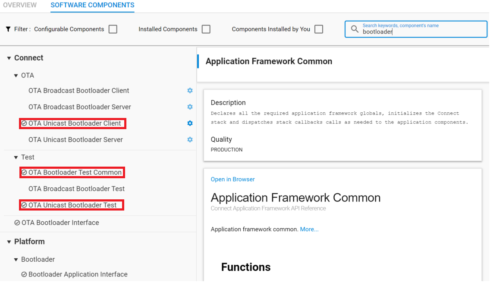
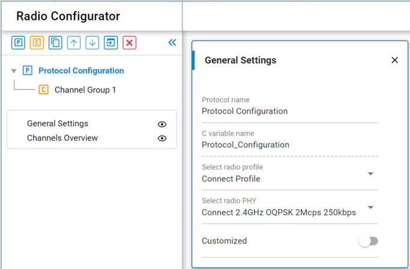
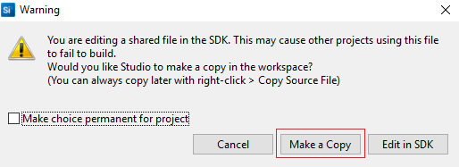
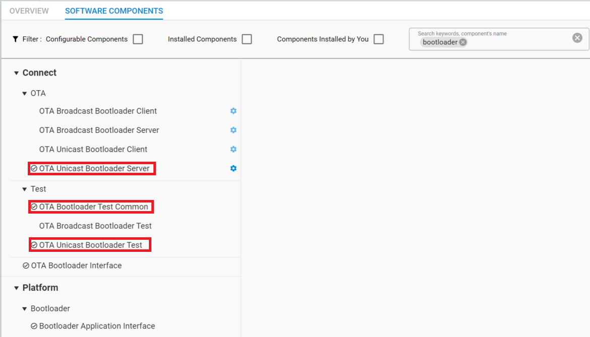

# 4. Proprietary OTA Update
Again, we would like to do simple comparison between current design and new design we propose here. That helps us better understanding what is major changes and how we optimized the OTA procedure. 

The proprietary is flexible, customer can define the behavior according to their real need. No standard SDK, pre-defined operations. That means we can choose whatever is best suit for our application. Here, we will not choose NCP on the server side.(In fact, only 6 NCP questions were raised during pass 15 months). We keeps a SoC as OTA server. Sending firmware image to the OTA serve via UART interface from PC. That makes thing much easier to implement. 

Get reference of detailed introduction of current design at [UG235.06: Bootloading and OTA with Silicon Labs Connect][UG235.06].

## 4.1. Current OTA process
* Connect OTA Client and OTA Server with UART console from PC
* Program OTA image file(sensorB.gbl) to OTA server
  * $commander.exe extflash write sensorB.gbl
* OTA server bootloader init, validate image, form and open network
  * $bootloader init
  * $bootloader validate-image
  * $form 0
  * $pjoin 120
* OTA client bootloader init, erase slot flash, join the network
  * $bootloader init
  * $bootloader flash-erase
  * $join 0
  * $bootloader set-tag 0xaa
* Start OTA update from OTA server
  * $bootloader unicast-set-target 0x0001
  * $bootloader unicast-dstribute 112560 0xaa  
    * Where 122560 is the size of the GBL image file in bytes. 
  * $bootloader unicast-request-bootload 1000 0xaa
    * Requests client bootloading after OTA update completed 
  

## 4.2. New OTA process
* Run terminal tool to connect with OTA Server, it forms and open the network
* Press BTN0 button on OTA Client. It joins the network and start OTA update automatically. 

The LED0 on board show the status of network and OTA update. 

## 4.3. Implementation
Here we start the detailed steps on implementation to achieve above design idea.
### 4.3.1. Proprietary OTA Client

We would like to achieve following functionalities.

* Press BTN0 button on OTA Client to start joining network and the OTA update
* LED0 ON indicates that OTA Client has joined the network. LED OFF is opposite meaning
* LED0 rapidly blinking(200ms on, 200ms off) indicates the OTA update in progress

A) Click on **Create New Project** in Simplicity Studio 5 launcher perspective. Choose **Proprietary**, Choose **Flex(Connect)-SoC Sensor**, press Next; Keep the project name as "sensor" unchanged, press Finish.

It open a sensor.slcp which can config Proprietary related functionalities. 

B) In **SOFTWARE COMPONENTS** tab, filter "bootloader" in search texbox.
* Install following components
  * OTA Unicast Bootloader Client
  * OTA Bootloader Test Common
  * OTA Unicast Bootloader Test 

<div align="center">
  
</div> 

C) If want to change the radio PHY, move to component **Radio Configurator**, default setting for TB BG22 is **Connect 2.4GHz OQPSK 2Mcps 250kbps**, no need to change. 

<div align="center">
  
</div> 

D) Open app_process.c, add halButtonIsr() in sl_button_on_change() for key event handle.

```C
void sl_button_on_change(const sl_button_t *handle)
{
  halButtonIsr(sl_button_get_state(handle));
  if (sl_button_get_state(handle) == SL_SIMPLE_BUTTON_PRESSED) {
    enable_sleep = !enable_sleep;
  }
}
```
E) Open app_callbacks.c add following source codes.

```C
#include "sl_ota_bootloader_test_common.h"
#include "sl_btl-interface.h"
#include "sl_simple_button.h"

EmberEventControl *button_event_control;
EmberEventControl *led_control;

#define SENSOR_SINK_COMMAND_ID_OTA_REQUEST  (0xA5)  //Don't overlap with enum define in sl_app_common.h

static bool flash_is_erased = false;
static bool ota_update = false;
extern EmberKeyData security_key;

void OtaImageDownloadCompleteCallback(void)
{
  ota_update = false;
}
/*
 * Join the network
 */
void joinNetwork(void)
{
  EmberNetworkParameters parameters;

  MEMSET(&parameters, 0, sizeof(EmberNetworkParameters));
  parameters.radioTxPower = SENSOR_SINK_TX_POWER;
  parameters.radioChannel = 0;
  parameters.panId = SENSOR_SINK_PAN_ID;

  emberClearSelectiveJoinPayload();

  emberJoinNetwork(EMBER_STAR_END_DEVICE, &parameters);
}

/*
 * Erase the slot flash for the first boot up.
 * Start joining the network if the device no network
 * Sending OTA update request to server once joined the network
 */
void button_handler(void)
{
  EmberNetworkStatus status;

  emberEventControlSetInactive(*button_event_control);

  if (flash_is_erased == false) {
    flash_is_erased = true;

    status = emberAfPluginBootloaderInterfaceInit();
    if (status) {
      APP_INFO("bootloader init succeeded!\n\r");
    } else {
      APP_INFO("bootloader init failed! wrong chip?\n\r");
    }

    APP_INFO("flash erase started\n");
    emberAfPluginBootloaderInterfaceChipErase();
    ota_resume_start_counter_reset = true;
  }

  status = emberNetworkState();
  APP_INFO("network status = 0x%x\n\r", status);
  if (EMBER_NO_NETWORK == status){
    APP_INFO("Joining the network\n\r");
    joinNetwork();
    emberEventControlSetDelayMS(*button_event_control, 2000);
  }

  if(EMBER_JOINED_NETWORK == status){
    char* is_ack = ((tx_options & EMBER_OPTIONS_ACK_REQUESTED) ? "enabled" : "disabled");
    char* is_security = ((tx_options & EMBER_OPTIONS_SECURITY_ENABLED) ? "enabled" : "disabled");
    char* is_high_prio = ((tx_options & EMBER_OPTIONS_HIGH_PRIORITY) ? "enabled" : "disabled");

    APP_INFO("Info:\r\n");
    APP_INFO("         MCU Id: 0x%llX\r\n", SYSTEM_GetUnique());
    APP_INFO("  Network state: 0x%02X\r\n", emberNetworkState());
    APP_INFO("      Node type: 0x%02X\r\n", emberGetNodeType());
    APP_INFO("        Node id: 0x%04X\r\n", emberGetNodeId());
    APP_INFO("         Pan id: 0x%04X\r\n", emberGetPanId());
    APP_INFO("        Channel: %d\r\n", (uint16_t)emberGetRadioChannel());
    APP_INFO("          Power: %d\r\n", (int16_t)emberGetRadioPower());
    APP_INFO("     TX options: MAC acks %s, security %s, priority %s\r\n", is_ack, is_security, is_high_prio);

    ota_update = true;

    //Slow down report period
    sensor_report_period_ms = (10 * MILLISECOND_TICKS_PER_SECOND);
    APP_INFO("Report period set to %d ms\n\r", sensor_report_period_ms);

    APP_INFO("Sending OTA update request\n\r");
    send(EMBER_COORDINATOR_ADDRESS, SENSOR_SINK_COMMAND_ID_OTA_REQUEST, NULL, 0);
  }
}

void halButtonIsr(uint8_t state)
{
  if (state == SL_SIMPLE_BUTTON_RELEASED) {
    emberEventControlSetDelayMS(*button_event_control, 300);
  }
}

void led_handler(void)
{
  emberEventControlSetInactive(*led_control);
  if (ota_update == true) {
    emberEventControlSetDelayMS(*led_control, 200);
    sl_led_toggle(&sl_led_led0);
  }else {
    emberEventControlSetDelayMS(*led_control, 2000);
    if (EMBER_NO_NETWORK == emberNetworkState()) {
      sl_led_turn_off(&sl_led_led0);
    } else {
      sl_led_turn_on(&sl_led_led0);
    }
  }
}
```
Replace emberAfInitCallback().
```c
void emberAfInitCallback(void)
{
  emberAfAllocateEvent(&report_control, &report_handler);
  emberAfAllocateEvent(&button_event_control, &button_handler);
  emberAfAllocateEvent(&led_control, &led_handler);
  // CLI info message
  APP_INFO("Sensor\r\n");

  ota_update = false;

  emberSetSecurityKey(&security_key);

  emberNetworkInit();

  emberEventControlSetDelayMS(*led_control, 1000);

#if defined(EMBER_AF_PLUGIN_BLE)
  bleConnectionInfoTableInit();
#endif
}
```
Comment out LED0 control in emberAfTickCallback().
```c
void emberAfTickCallback(void)
{
//  if (emberStackIsUp()) {
//    sl_led_turn_on(&sl_led_led0);
//  } else {
//    sl_led_turn_off(&sl_led_led0);
//  }
}
```
F) Open $(SDK_PATH)\gecko_sdk_3.0.0\app\flex\component\connect\sl_connect_ota_unicast_bootloader_test\sl_connect_ota_unicast_bootloader_test.c, add OtaImageDownloadCompleteCallback() in emberAfPluginOtaUnicastBootloaderClientImageDownloadCompleteCallback().
```c
void emberAfPluginOtaUnicastBootloaderClientImageDownloadCompleteCallback(EmberAfOtaUnicastBootloaderStatus status,
                                                                          uint8_t imageTag,
                                                                          uint32_t imageSize)
{
  OtaImageDownloadCompleteCallback();
  if (status == EMBER_OTA_UNICAST_BOOTLOADER_STATUS_SUCCESS) {
    APP_INFO("Image download COMPLETED tag=0x%x size=%lu\n",
             imageTag, imageSize);
    unicast_download_start_index = 0;
  } else {
    APP_INFO("Image download FAILED status=0x%x\n", status);
  }
}
```
Please don't modify SDK file directly, copy it to local then modify.
<div align="center">
  
</div> 


G) Build the project and download the firmware image sensor.s37 into the OTA Client. 

If you don't know how to process it. Please get detailed reference at [Download firmware Image][Flash-Image]

H) Generate client OTA image by double click "connect_create_gbl_image.bat" file.
 Make any changes in the source code and build the project to generate OTA image sensor.gbl. For example, print "Sensor V2" in emberAfInitCallback() function.

```c
void emberAfInitCallback(void)
{
  emberAfAllocateEvent(&report_control, &report_handler);
  emberAfAllocateEvent(&button_event_control, &button_handler);
  emberAfAllocateEvent(&led_control, &led_handler);
  // CLI info message
  APP_INFO("Sensor V2\r\n");

  ota_update = false;

  emberSetSecurityKey(&security_key);

  emberNetworkInit();

  emberEventControlSetDelayMS(*led_control, 1000);

#if defined(EMBER_AF_PLUGIN_BLE)
  bleConnectionInfoTableInit();
#endif
}
```

### 4.3.2. Proprietary OTA Server
For the design of OTA Server. We would like to achieve following functionalities.

The "SoC sink" running on OTA Server. It automatic form and open the network to let OTA Client join the network. It starts the OTA update while received OTA update request from OTA Client. And it send the reboot request to OTA Client once OTA image transfer complete. 

A) Click on **Create New Project** in Simplicity Studio 5 launcher perspective. Choose **Proprietary**, Choose **Flex(Connect)-SoC sink**, press Next; Keep the project name as "sink" unchanged, press Finish.

It open a sink.slcp which can config Proprietary related functionalities. 

B) In **SOFTWARE COMPONENTS** tab, filter "bootloader" in search texbox.
* Install following components
  * OTA Unicast Bootloader Server
  * OTA Bootloader Test Common
  * OTA Unicast Bootloader Test 

<div align="center">
  
</div> 

C) If want to change the radio PHY, move to component **Radio Configurator**, default setting for TB BG22 is **Connect 2.4GHz OQPSK 2Mcps 250kbps**, no need to change. 

<div align="center">
  
</div> 

D) Open app_callbacks.c add following source codes.

```C
#include "sl_ota_bootloader_test_common.h"
#include "sl_btl-interface.h"

EmberEventControl *commission_control;
EmberEventControl *led_control;

#define GBL_End_Tag                         (0xFC0404FC)
#define NETWORK_WINDOW_OPEN                 (240)
#define NETWORK_WINDOW_CLOSE                (0)
#define BOOTLAODER_DELAY_MS                 (1000)
#define SENSOR_SINK_COMMAND_ID_OTA_REQUEST  (0xA5)  //Don't overlap with enum define in sl_app_common.h

static bool first_boot = true;
static uint8_t client_node_id = 0xFF;
static bool ota_update = false;

typedef struct {
  uint32_t tag;
  uint32_t len;
} GblTag_t;

bool emberAfPluginBootloaderInterfaceRead(uint32_t startAddress,uint32_t length,uint8_t *buffer);
uint16_t emberAfPluginBootloaderInterfaceValidateImage(void);


/**
 * Read TAG of OTA GBL image and calculate the size of GBL
 */
uint32_t parseGBLSize(void)
{
  uint32_t size = 0;
  GblTag_t gbl;
  while(1){
    emberAfPluginBootloaderInterfaceRead(size,8, (uint8_t *)&gbl);
    size = size + 8 + gbl.len;
    APP_INFO("GBL tag = 0x%4x, len = 0x%4x, size = 0x%4x\r\n", gbl.tag, gbl.len, size);
    // reach end tag of GBL
    if (gbl.tag == GBL_End_Tag){
        APP_INFO("reach end of tag of GBL\r\n");
      break;
    }
  }
  return size;
}

/**
 * Start the OTA update process. Default tag = 0x89
 */
void otaUnicastStartDistribution(EmberNodeId node_id)
{
  uint32_t size = 0;
  uint8_t status;

  client_node_id = node_id;
  size = parseGBLSize();
  status = emberAfPluginOtaUnicastBootloaderServerInitiateImageDistribution(
              client_node_id, size, DEFAULT_IMAGE_TAG);

  if (status){
    APP_INFO("unicast image distribution failed 0x%x\r\n", status);
  }else{
    APP_INFO("unicast image distribution initiated.\r\n");
  }
}

/**
 * Sending the client reboot request
 */
void OtaUnicastDistributionCompleteCallback(void)
{
  APP_INFO("Request client reboot.\r\n");
  ota_update = false;
  emberAfPluginUnicastBootloaderServerInitiateRequestTargetBootload(BOOTLAODER_DELAY_MS, DEFAULT_IMAGE_TAG, client_node_id);
}

/**
 * For the network
 */
void formNetwork(void)
{
  EmberStatus status;
  EmberNetworkParameters parameters;

  MEMSET(&parameters, 0, sizeof(EmberNetworkParameters));
  parameters.radioTxPower = SENSOR_SINK_TX_POWER;
  parameters.radioChannel = 0;
  parameters.panId = SENSOR_SINK_PAN_ID;

  status = emberFormNetwork(&parameters);

  APP_INFO("form 0x%x\r\n", status);
}

/**
 * Open the network for 240 seconds.
 */
void permitJoinNetwork(uint8_t duration)
{
  emberClearSelectiveJoinPayload();
  if(duration)
    APP_INFO("Permit Joining Network %d\r\n", duration);
  else
    APP_INFO("Network Joining Disable.\r\n");
  emberPermitJoining(duration);
}

/**
 * Validate the OTA image at first boot up
 * Form and open the network is network is down
 */
void commission_handler()
{
  emberEventControlSetInactive(*commission_control);

  if (first_boot) {
    //cli_bootloader_init(0);
    if (emberAfPluginBootloaderInterfaceInit()) {
      APP_INFO("bootloader init succeeded!\r\n");
    } else {
      APP_INFO("bootloader init failed! wrong chip?\r\n");
    }

    if (!emberAfPluginBootloaderInterfaceValidateImage()) {
      APP_INFO("Image is invalid!\r\n");
      return;
    } else {
      first_boot = 0;
      APP_INFO("Image is valid!\r\n");
    }

  }
  //if(!emberStackIsUp()){
  if (EMBER_NO_NETWORK == emberNetworkState()){
    formNetwork();
  }

  if (EMBER_NO_NETWORK != emberNetworkState()){
    APP_INFO("Open the network!\r\n");
    permitJoinNetwork(NETWORK_WINDOW_OPEN);
  }

  ota_update = false;

  //Show out network status.
  char* is_ack = ((tx_options & EMBER_OPTIONS_ACK_REQUESTED) ? "enabled" : "disabled");
  char* is_security = ((tx_options & EMBER_OPTIONS_SECURITY_ENABLED) ? "enabled" : "disabled");
  char* is_high_prio = ((tx_options & EMBER_OPTIONS_HIGH_PRIORITY) ? "enabled" : "disabled");

  APP_INFO("Info:\r\n");
  APP_INFO("         MCU Id: 0x%llX\r\n", SYSTEM_GetUnique());
  APP_INFO("  Network state: 0x%02X\r\n", emberNetworkState());
  APP_INFO("      Node type: 0x%02X\r\n", emberGetNodeType());
  APP_INFO("        Node id: 0x%04X\r\n", emberGetNodeId());
  APP_INFO("         Pan id: 0x%04X\r\n", emberGetPanId());
  APP_INFO("        Channel: %d\r\n", (uint16_t)emberGetRadioChannel());
  APP_INFO("          Power: %d\r\n", (int16_t)emberGetRadioPower());
  APP_INFO("     TX options: MAC acks %s, security %s, priority %s\r\n", is_ack, is_security, is_high_prio);

}

void led_handler(void)
{
  emberEventControlSetInactive(*led_control);
  if (ota_update == true) {
    emberEventControlSetDelayMS(*led_control, 200);
    sl_led_toggle(&sl_led_led0);
  }else {
    emberEventControlSetDelayMS(*led_control, 2000);
    if (EMBER_NO_NETWORK == emberNetworkState()) {
      sl_led_turn_off(&sl_led_led0);
    } else {
      sl_led_turn_on(&sl_led_led0);
    }
  }
}
```
Replace emberAfInitCallback().
```c
void emberAfInitCallback(void)
{
  emberAfAllocateEvent(&advertise_control, &advertise_handler);
  emberAfAllocateEvent(&data_report_control, &data_report_handler);
  emberAfAllocateEvent(&commission_control, &commission_handler);
  emberAfAllocateEvent(&led_control, &led_handler);
  // CLI info message
  APP_INFO("Sink\r\n");

  emberSetSecurityKey(&security_key);
  sink_init();
  emberNetworkInit();

  emberEventControlSetDelayMS(*commission_control, 1000);
  emberEventControlSetDelayMS(*led_control, 1000);
#if defined(EMBER_AF_PLUGIN_BLE)
  bleConnectionInfoTableInit();
#endif
}
```
Add start distribution process in emberAfIncomingMessageCallback().
```c
void emberAfIncomingMessageCallback(EmberIncomingMessage *message)
{
  if (message->length < SENSOR_SINK_MINIMUM_LENGTH
      || (emberFetchLowHighInt16u(message->payload + SENSOR_SINK_PROTOCOL_ID_OFFSET)
          != SENSOR_SINK_PROTOCOL_ID)) {
    return;
  }

  switch (message->payload[SENSOR_SINK_COMMAND_ID_OFFSET]) {
    case SENSOR_SINK_COMMAND_ID_OTA_REQUEST:
      permitJoinNetwork(NETWORK_WINDOW_CLOSE);
      ota_update = true;

      APP_INFO("Start the OTA process! NodeId:0x%x\r\n", message->source);
      otaUnicastStartDistribution(message->source);
      break;

    case SENSOR_SINK_COMMAND_ID_ADVERTISE_REQUEST:
```
Comment out LED0 control in emberAfTickCallback().
```c
void emberAfTickCallback(void)
{
  // Time out sensors that have not reported in a while.
  uint32_t nowMs = halCommonGetInt32uMillisecondTick();
  uint8_t i;
  for (i = 0; i < SENSOR_TABLE_SIZE; i++) {
    if (sensors[i].node_id != EMBER_NULL_NODE_ID) {
      if (SENSOR_TIMEOUT_MS
          < elapsedTimeInt32u(sensors[i].last_report_ms, nowMs)) {
        APP_INFO("EVENT: timed out sensor 0x%04X\n",
                 sensors[i].node_id);
        sensors[i].node_id = EMBER_NULL_NODE_ID;
      }
    }
  }

  //if (emberStackIsUp()) {
  //  sl_led_turn_on(&sl_led_led0);
  //} else {
  //  sl_led_turn_off(&sl_led_led0);
  //}
}
```
E) Open $(SDK_PATH)\gecko_sdk_3.0.0\app\flex\component\connect\sl_connect_ota_unicast_bootloader_test\sl_connect_ota_unicast_bootloader_test.c, add OtaUnicastDistributionCompleteCallback() in emberAfPluginOtaUnicastBootloaderServerImageDistributionCompleteCallback().
```c
void emberAfPluginOtaUnicastBootloaderServerImageDistributionCompleteCallback(EmberAfOtaUnicastBootloaderStatus status)
{
  APP_INFO("image distribution completed, 0x%x\n", status);
  OtaUnicastDistributionCompleteCallback();
}
```
Please don't modify SDK file directly, copy it to local then modify.
<div align="center">
  
</div> 


F) Build the project and download the firmware image sink.s37 into the OTA Server. 

If you don't know how to process it. Please get detailed reference at [Download firmware Image][Flash-Image]


### 4.3.3. Proprietary OTA Update
* Connect OTA Server and OTA Client to PC
* Program OTA image sensor.bin(GBL format) to OTA Server
  * commander.exe flash --address 0x84000 --serialno 440045424 sensor.bin
  * Change the address to 0x44000 for a 512KB flash devide
  * Change serialno accordingly
* Press BTN0 on OTA Client start joining network and begin OTA update
  * The LED0 is ON for indicates joined network
  * The LED0 keep rapidly blinking(200ms on, 200ms off) during OTA update procedure
  * Once the OTA Client recieve complete it will reboot and update new image to application area
